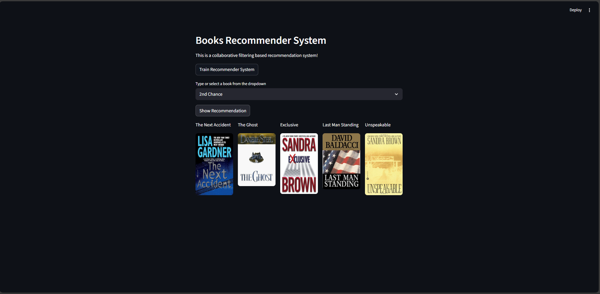

# 📚  **Book Recommender System** [VIDEO](https://github.com/user-attachments/assets/7f663a5c-930e-49b2-8531-da1da81e4fcd)

Book-Recommender Image.png

An end-to-end Machine Learning project that suggests books based on user preferences. Built with a production-grade modular pipeline, containerized with Docker, and deployed on AWS.

# 🚀 **Overview**

This project goes beyond a simple recommendation script. It implements a complete MLOps pipeline ensuring that every step—from data ingestion to model serving—is automated, validated, and scalable.

# Key Features

**Modular Architecture**: Clean separation of concerns with dedicated components for Ingestion, Transformation, and Validation.

**Production Code**: Implements robust logging, custom exception handling, and configuration-driven development.

**Interactive UI**: A sleek, user-friendly interface built with Streamlit for real-time recommendations.

**Containerized**: Fully Dockerized to ensure "it works on my machine" everywhere.

**Cloud Ready**: Optimized for deployment on AWS EC2.

# 🏗️ Project Structure & Pipeline

The project follows a modular structure common in industry-standard ML systems:

**Data Ingestion**: Automatically fetches and splits the raw book data.

**Data Transformation**: Handles feature engineering and preprocessing using scikit-learn pipelines.

**Data Validation**: Ensures incoming data meets schema requirements before processing.

**Model Trainer**: Trains the recommendation engine (Collaborative Filtering/Content-Based) and exports the best model artifacts.

# 💻 Getting Started
  
**Prerequisites**

Python 3.8+

Docker (Optional, for containerized execution)

# Local Installation

**Clone the repository**

Bash

    git clone https://github.com/harshkumar8a/Book-Recommender-System.git

    cd Book-Recommender-System

**Create a virtual environment**

Bash

    conda activate .conda

**Install dependencies**

Bash

    pip install -r requirements.txt

**Run the Application**

Bash

    streamlit run app.py

**🐳 Running with Docker**

To run the application without worrying about local dependencies:

**Build the image**

Bash

    docker build -t book-recommender .

**Run the container**

Bash

    docker run -p 8501:8501 book-recommender

Visit http://localhost:8501 in your browser.

**☁️ Deployment on AWS EC2**

To host this application on an AWS EC2 instance:

Launch Instance: Create a T2.Medium (or higher) instance with Ubuntu.

Security Groups: Open port 8501 (Streamlit) and 22 (SSH) in the Inbound rules.

Connect & Setup:

Bash

    ssh -i "your-key.pem" ubuntu@your-ec2-ip
    sudo apt-get update && sudo apt-get install docker.io -y

**Deploy**:

 Clone your repo onto the instance, build the Docker image, and run it.

**Tip**: 

Use **docker run -d** to run it in detached mode so it stays active after you close the terminal.

# 🛠️ Technologies Used
Language: Python

Frontend: Streamlit

ML Libraries: Pandas, NumPy, Scikit-Learn

DevOps: Docker

Cloud: AWS (EC2)

📧 Contact
Harsh Kumar [Email](mailto:harshkumar811h@gmail.com)

